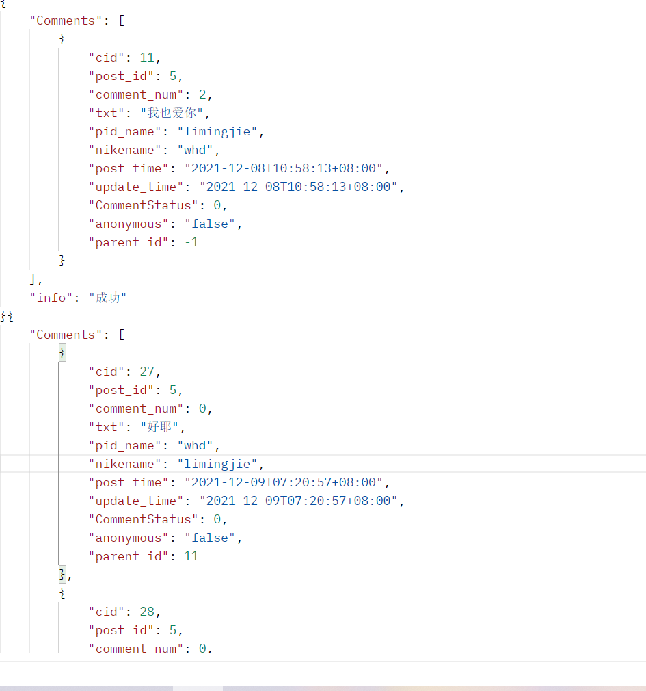

# message_board
##user
```
+----------+--------------+------+-----+---------+----------------+
| Field    | Type         | Null | Key | Default | Extra          |
+----------+--------------+------+-----+---------+----------------+
| id       | int          | NO   | PRI | NULL    | auto_increment |
| username | varchar(20)  | YES  |     | NULL    |                |
| password | varchar(225) | YES  |     | NULL    |                |
| avatar    | varchar(255) | YES  |     | NULL    |                |
+----------+--------------+------+-----+---------+----------------+
CREATE TABLE `user` (
  `id` int NOT NULL AUTO_INCREMENT,
  `username` varchar(20) DEFAULT NULL,
  `password` varchar(225) CHARACTER SET utf8mb4 COLLATE utf8mb4_0900_ai_ci DEFAULT NULL,
  `avatar` varchar(255) CHARACTER SET utf8mb4 COLLATE utf8mb4_0900_ai_ci DEFAULT NULL,
  PRIMARY KEY (`id`)
) ENGINE=InnoDB AUTO_INCREMENT=9 DEFAULT CHARSET=utf8mb4 COLLATE=utf8mb4_0900_ai_ci;
```

---
##post
```
+-------------+--------------+------+-----+---------+----------------+
| Field       | Type         | Null | Key | Default | Extra          |
+-------------+--------------+------+-----+---------+----------------+
| id          | int          | NO   | PRI | NULL    | auto_increment |
| txt         | varchar(255) | YES  |     | NULL    |                |
| username    | varchar(20)  | YES  |     | NULL    |                |
| post_time   | datetime     | YES  |     | NULL    |                |
| update_time | datetime     | YES  |     | NULL    |                |
| comment_num | int          | NO   |     | 0       |                |
+-------------+--------------+------+-----+---------+----------------+
CREATE TABLE `post` (
  `id` int NOT NULL AUTO_INCREMENT,
  `txt` varchar(255) CHARACTER SET utf8mb4 COLLATE utf8mb4_0900_ai_ci DEFAULT NULL,
  `username` varchar(20) DEFAULT NULL,
  `post_time` datetime DEFAULT NULL,
  `update_time` datetime DEFAULT NULL,
  `comment_num` int NOT NULL DEFAULT '0',
  PRIMARY KEY (`id`)
) ENGINE=InnoDB AUTO_INCREMENT=15 DEFAULT CHARSET=utf8mb4 COLLATE=utf8mb4_0900_ai_ci;
```
##comment
```
+----------------+--------------+------+-----+---------+----------------+
| Field          | Type         | Null | Key | Default | Extra          |
+----------------+--------------+------+-----+---------+----------------+
| id             | int          | NO   | PRI | NULL    | auto_increment |
| comment_num    | int          | YES  |     | 0       |                |
| txt            | varchar(255) | YES  |     | NULL    |                |
| username       | varchar(20)  | YES  |     | NULL    |                |
| post_time      | datetime     | YES  |     | NULL    |                |
| update_time    | datetime     | YES  |     | NULL    |                |
| pid_comment    | int          | YES  |     | -1      |                |
| post_id        | int          | YES  |     | 0       |                |
| comment_status | tinyint      | NO   |     | 0       |                |
| name_status    | varchar(20)  | NO   |     | false   |                |
| pid_name       | varchar(20)  | YES  |     | NULL    |                |
+----------------+--------------+------+-----+---------+----------------+
CREATE TABLE `comment` (
  `id` int NOT NULL AUTO_INCREMENT,
  `comment_num` int DEFAULT '0',
  `txt` varchar(255) CHARACTER SET utf8mb4 COLLATE utf8mb4_0900_ai_ci DEFAULT NULL,
  `username` varchar(20) CHARACTER SET utf8mb4 COLLATE utf8mb4_0900_ai_ci DEFAULT NULL,
  `post_time` datetime DEFAULT NULL,
  `update_time` datetime DEFAULT NULL,
  `pid_comment` int DEFAULT '-1',
  `post_id` int DEFAULT '0',
  `comment_status` tinyint NOT NULL DEFAULT '0',
  `name_status` varchar(20) CHARACTER SET utf8mb4 COLLATE utf8mb4_0900_ai_ci NOT NULL DEFAULT 'false',
  `pid_name` varchar(20) DEFAULT NULL,
  PRIMARY KEY (`id`)
) ENGINE=InnoDB AUTO_INCREMENT=30 DEFAULT CHARSET=utf8mb4 COLLATE=utf8mb4_0900_ai_ci;
```
---
**其中post_id 是评论归属的留言，name_status是匿名状态<br>
pid_name是对留言的user或者是评论的user,pid_comment 是回复评论的评论Id**
##TOOL
###Lv1
● 注册，登陆，修改密码<br>
● 发表留言，删除留言，查看所有留言，查看一个留言及其下属评论<br>
● 发表评论，删除评论(软删除)<br>
###Lv2
● 对密码加盐<br>
● 预加载，防sql注入<br>
● 采用hash,提高匹配效率，审查评论或留言内容<br>
● 匿名评论<br>
● jwt鉴权<br>
###Lv3
● 数据库设计 设计了评论的父类留言的id 即post_id，回复评论的id 即 pid_comment<br>
● 对评论进行评论<br>
● 通过post_id 来查询留言下的所有评论不包括子评论<br>
● 通pid_comment 来查询评论下的所有回复<br>
**第一个显示的为你要查询的comment的 id 后面显示其pid_comment=id 的评论**

**pis:本来想做嵌套json 来体现套娃评论一级一级查询下去 但想了好久都做不了 写了递归一直报错 心态裂开只能这样了**